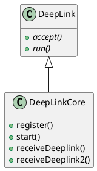
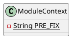

front-matter ==fads==
### A

```plantuml
@startuml

DeepLink <|-- DeepLinkCore


Class DeepLink {
    {abstract}+accept()
    {abstract}+run()
}

Class DeepLinkCore {
    +register()
    +start()
    +receiveDeeplink()
    +receiveDeeplink2()
}
@enduml
```

```plantuml
@startuml
Class ModuleContext {
    -{static}String PRE_FIX
}
@enduml
```
