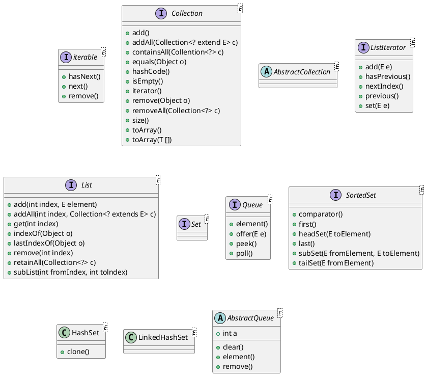

```plantuml
@startuml
interface iterable<E> {
    +hasNext()
    +next()
    +remove()
}
interface Collection<E> {
    +add()
    +addAll(Collection<? extend E> c)
    +containsAll(Collention<?> c)
    +equals(Object o)
    +hashCode()
    +isEmpty()
    +iterator()
    +remove(Object o)
    +removeAll(Collection<?> c)
    +size()
    +toArray()
    +toArray(T [])
}
abstract AbstractCollection<E> {
}
interface ListIterator<E> {
    +add(E e)
    +hasPrevious()
    +nextIndex()
    +previous()
    +set(E e)
}
interface List<E> {
    +add(int index, E element)
    +addAll(int index, Collection<? extends E> c)
    +get(int index)
    +indexOf(Object o)
    +lastIndexOf(Object o)
    +remove(int index)
    +retainAll(Collection<?> c)
    +subList(int fromIndex, int tolndex)
}
interface Set<E> {

}
interface Queue<E> {
    +element()
    +offer(E e)
    +peek()
    +poll()
}
interface SortedSet<E> {
    +comparator()
    +first()
    +headSet(E toElement)
    +last()
    +subSet(E fromElement, E toElement)
    +tailSet(E fromElement)
}
class HashSet<E> {
    +clone()
}
class LinkedHashSet<E> {

}
abstract AbstractQueue<E> {
    +int a
    +clear()
    +element()
    +remove()
}

@enduml
```